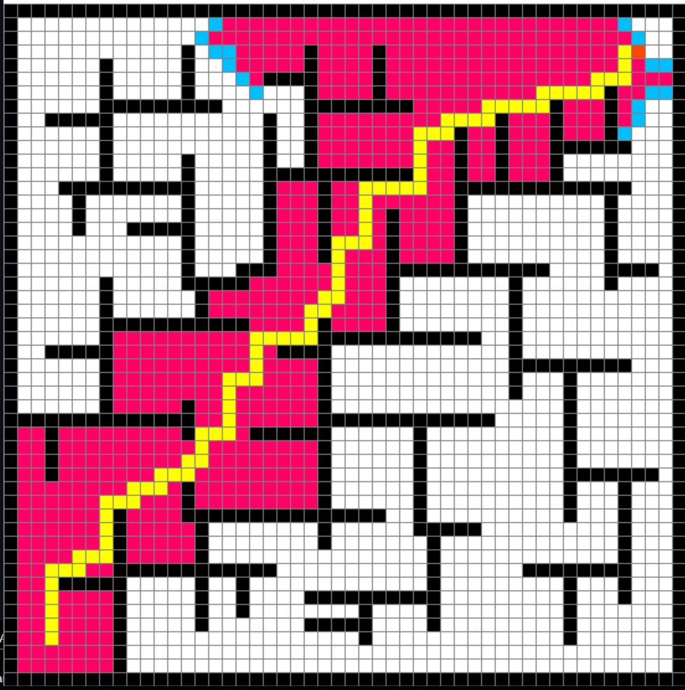
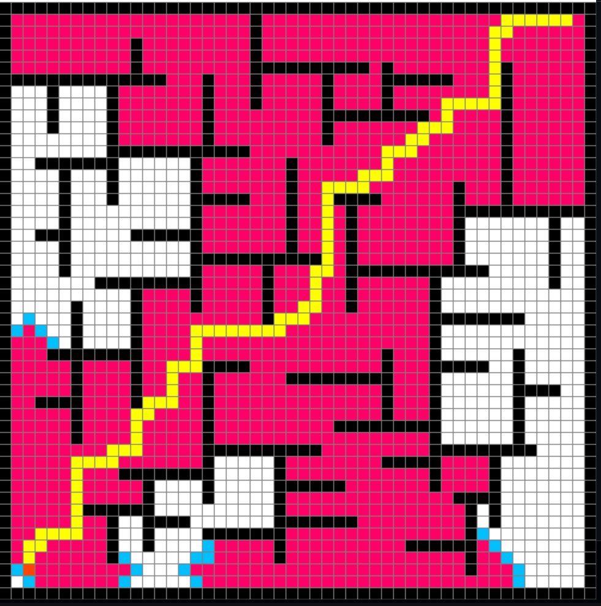
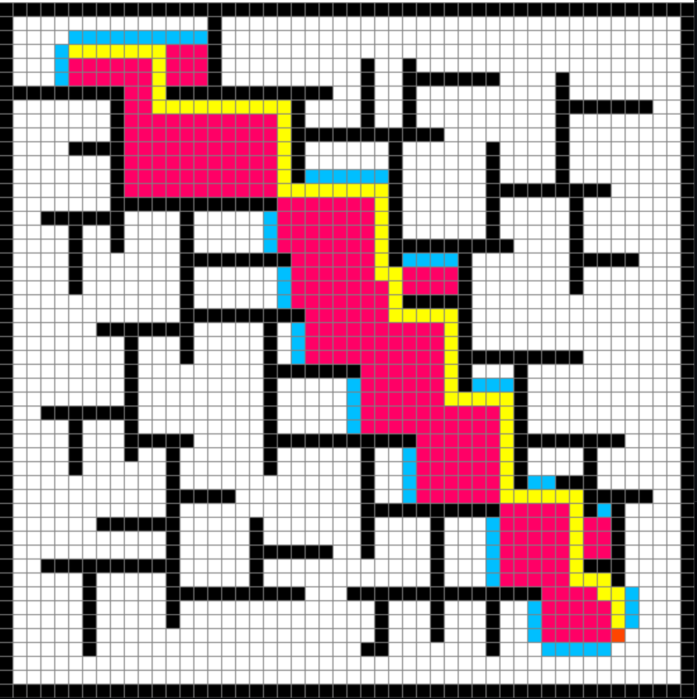

# 🧭 Pathfinder Visualizer

This repository contains a visual implementation of the **A\*** pathfinding algorithm and other algorithms such as **BFS**, **Dijkstra**, and **Prim's Algorithm**. The implementation uses **Pygame** 🕹️ for the graphical interface and interactive grid-based pathfinding visualization.

| 🟢 **BFS Algorithm**                 | 🔵 **DFS Algorithm**                 | ⭐ **A\* Algorithm**                  |
| ------------------------------------ | ------------------------------------ | ------------------------------------- |
|  |  |  |

## ✨ Features

- 🖱️ **Interactive Grid**: Users can click to set the start and end points and add barriers.
- 🧠 **Multiple Algorithms**: Supports A\*, BFS, Dijkstra, and Prim's algorithms for pathfinding.
- 📊 **Real-time Visualization**: Watch how each algorithm explores the grid and finds the optimal path.
- 🔧 **Customizable Grid Size**: A 50x50 grid is used by default, but can be modified.

## ⚙️ Installation

To run this project locally, follow these steps:

1. **Clone the repository**:

   ```bash
   git clone https://github.com/ahmedyar7/PathFinder.git
   cd PathFinder
   ```

2. **Install the required dependencies**:
   You need to have Python installed along with the `pygame` library.

   ```bash
   pip install pygame
   ```

3. **Run the program**:
   ```bash
   py main.py
   ```

<div align="center">
   <a href="https://www.python.org/">
      
  </a>
  <a href="https://www.pygame.org/news">
      
  </a>
</div>

## 🛠️ Usage

After starting the program, an interactive window will open where you can draw the start and end points, barriers, and choose different algorithms to visualize their pathfinding.

### 🎮 Basic Interactions:

- **Left-click**: Add a start, end, or barrier.
- **Right-click**: Remove a barrier, start, or end node.
- **Keyboard shortcuts**:
  - `SPACE`: Starts pathfinding using the **A\*** algorithm.
  - `B`: Starts pathfinding using **BFS**.
  - `D`: Starts pathfinding using **Dijkstra's algorithm**.
  - `P`: Starts pathfinding using **Prim's algorithm**.
  - `R`: Resets the grid.

## 🧠 How It Works

### Files Overview

#### `program.py`

This is the main driver file for the project. It handles the game loop 🎮 and user interactions with the grid, including mouse clicks 🖱️ and keyboard inputs ⌨️. It calls the necessary functions to start different algorithms and updates the grid in real-time.

Key components:

- **`Program` class**: Manages the entire application.
- **`driver` method**: The main loop for drawing and interacting with the grid. It handles mouse and keyboard inputs and triggers the pathfinding algorithms.
- **`get_clicked_pos` method**: Converts mouse clicks into grid coordinates, helping to select the start/end nodes or barriers.

#### `grid.py`

This file contains the code for setting up and rendering the grid 🟦.

Key components:

- **`make_grid` method**: Initializes a 2D grid of "spot" objects, representing each cell in the grid.
- **`draw` method**: Renders the grid and its components (start, end, barriers, path).
- **`draw_grid` method**: Draws the grid lines to visually divide the window into a grid.

#### `algorithm.py`

This file contains the implementation of the four pathfinding algorithms.

Key components:

- **`Algorithm` class**: Contains methods for each algorithm (A\*, BFS, Dijkstra, Prim).
- **`heuristic_function`**: A heuristic function used by the A\* algorithm to estimate the distance between nodes (Manhattan distance 📐).
- **`reconstruct_path`**: Backtracks from the end node to the start node after finding the shortest path, marking the path on the grid.

Each algorithm method (e.g., `a_star_algorithm`, `bfs_algorithm`) operates by:

1. Using different techniques to explore the grid.
2. Keeping track of visited nodes and neighbors.
3. Reconstructing and visualizing the optimal path 🛤️.

#### `spot.py`

This file defines the `Spot` class, representing each cell in the grid.

Key components:

- **`Spot` class**: Manages the state of each cell (is it the start node, end node, barrier, open, closed, etc.).
- **`draw` method**: Renders each cell on the screen 🎨.
- **`update_neighbors` method**: Updates the list of neighboring cells for a given spot, which is crucial for pathfinding algorithms.

## 🚀 Algorithms Supported

- **A\* Algorithm**: Uses a heuristic function 🧠 to explore nodes, balancing between exploring the shortest known path and the estimated distance to the goal.
- **Dijkstra's Algorithm**: Explores nodes in increasing order of distance from the start, ensuring the shortest path is found (like A\* but without a heuristic).
- **Prim's Algorithm**: Typically used for minimum spanning trees 🌲, here adapted for pathfinding.
- **Breadth-First Search (BFS)**: Explores all possible nodes layer by layer, guaranteeing the shortest path in an unweighted grid.

## 🎯 Controls

- **Left-click**:
  - First click: Set start node 🟢.
  - Second click: Set end node 🔴.
  - Subsequent clicks: Set barriers 🟦.
- **Right-click**: Remove a node or barrier ❌.
- **`SPACE`**: Start **A\*** pathfinding ⭐.
- **`B`**: Start **BFS** pathfinding 🟢.
- **`D`**: Start **Dijkstra's** pathfinding ⚙️.
- **`P`**: Start **Prim's** pathfinding 🌲.
- **`R`**: Reset the grid to the initial state 🔄.

## 📜 License

This project is open-source and available under the [MIT License](LICENSE). 📝
